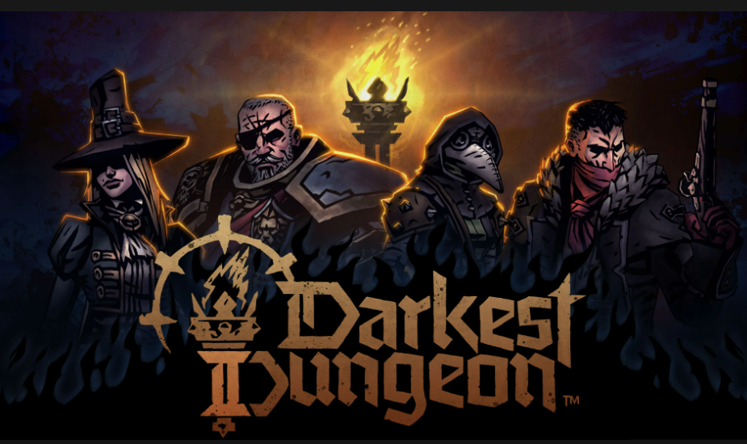

# ⚔️ Darkest Dungeon - Projet C

## Description  
Ce projet est un petit jeu de gestion de donjon réalisé en langage **C** dans le cadre du cours de programmation. Inspiré par le jeu **Darkest Dungeon**, il propose une simulation simple de combats entre héros et monstres. 
L'objectif était de mettre en pratique les notions de :  
- **Structures et pointeurs**  
- **Listes chaînées**  
- **Gestion de la mémoire dynamique (malloc, free)**  
- **Fonctions, gestion des fichiers et modularité**  

---

## Aperçu du projet  


---

##  Cloner le projet  
```bash
git clone https://github.com/taousoumaouche/darkest_dungeon_c.git
cd darkest_dungeon_c
```

---

## Compilation et exécution  

### Avec **GCC** (recommandé) :  
```bash
gcc -Wall -Wextra -std=c99 Projet.c -o projet

./projet
```

### Ou avec **Clang** :  
```bash
clang -Wall -Wextra -std=c99 Projet.c -o projet
./projet
```

 **Remarques :**  
- Testé sous Linux. Peut également fonctionner sous Windows avec **WSL** ou **MinGW**.  
- Le projet ne nécessite aucune bibliothèque externe.

---

## Auteurs  
Projet réalisé par :  
- **Oumaouche Taous**

---

## Licence  
Ce projet est libre d’utilisation et de modification à des fins **pédagogiques** ou **personnelles**.  
N’hésitez pas à contribuer ou à proposer des améliorations !

---
